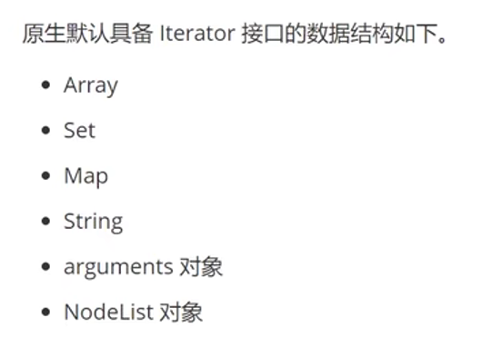

# ES6

Iterator 迭代器,Set 结构,Map 结构

1. Iterator 迭代器 遍历就是访问数据结构的所有元素，而迭代是遍历的一种形式。
   <https://blog.csdn.net/weixin_43342105/article/details/108685895>
   笔记很详尽。
   三个作用：

   - 一是为各种数据解构，提供一个统一的、简介的访问接口；
   - 二是的数据结构的成员能够按照某种次序排列；
   - 三是 es6 创造了一种新的遍历命令 for...of 循环，Iterator 接口主要供 for ...of 循环
     
     遍历的例子：
     ```JS
      let str = "ww"
      for ( let i of str ){
        console.log ( i )
      }
     ```
     Iterator 规范————Iterator 迭代器包含一个 next()方法，方法调用返回返回两个属性：done 和 value；
     通过定义一个对象的 Symbol.iterator 属性，即可将此对象修改为迭代器对象，支持 for...of 遍历。

2. Set 结构 ：类似于数组，但是成员的值的都是唯一的，没有重复的值
   初始化方式:

   ```JS
   //第一种方式
   let s1 = new Set([1,2,3,4])
   //第二种方式
   let s2 = new Set()
   s2.add(1)
   s2.add(2)
   ```

   set 属性和方法：

   - Set.size set 数据结构的值的个数
   - Set.prototype.constructor：构造函数，默认就是 Set 函数。
   - Set.prototype.size：返回 Set 实例的成员总数。

   Set 实例的方法分为两大类：操作方法（用于操作数据）和遍历方法（用于遍历成员）。下面先介绍四个操作方法。

   - Set.prototype.add(value)：添加某个值，返回 Set 结构本身。
   - Set.prototype.delete(value)：删除某个值，返回一个布尔值，表示删除是否成功。
   - Set.prototype.has(value)：返回一个布尔值，表示该值是否为 Set 的成员。
   - Set.prototype.clear()：清除所有成员，没有返回值

   Set 结构的实例有四个遍历方法，可以用于遍历成员。

   - Set.prototype.keys()：返回键名的遍历器
   - Set.prototype.values()：返回键值的遍历器
   - Set.prototype.entries()：返回键值对的遍历器
   - Set.prototype.forEach(item,index)：使用回调函数遍历每个成员
     需要特别指出的是，Set 的遍历顺序就是插入顺序。这个特性有时非常有用，比如使用 Set 保存一个回调函数列表，调用时就能保证按照添加顺序调用。

   实例：

   ```JS
   let arr = [1,2,2,"ww","ww",[1,2][3,4],[1,2],{name:"ww"},{age:10},{name:"ww"}]//去重
   function uni(arr){
    let res = new Set()
    return arr.filter((item)=>{
      //判断has 重复就是false,没有的话就是true
      let id = JSON.stringify(item)
      if(res.has(id)){
        return false
      }else{
        res.add(id)
        return true
      }
    })
   }
   ```

   补充的知识点：JSON.stringify()
   JSON 通常用于与服务端交换数据。在向服务器发送数据时一般是字符串。我们可以使用 JSON.stringify() 方法将 JavaScript 对象转换为字符串。

   ```JS
   JSON.stringify(value[, replacer[, space]])
   ```

   参数说明：

   - value:必需， 要转换的 JavaScript 值（通常为对象或数组）。
   - replacer:可选。用于转换结果的函数或数组。
     如果 replacer 为函数，则 JSON.stringify 将调用该函数，并传入每个成员的键和值。使用返回值而不是原始值。如果此函数返回 undefined，则排除成员。根对象的键是一个空字符串：""。
     如果 replacer 是一个数组，则仅转换该数组中具有键值的成员。成员的转换顺序与键在数组中的顺序一样。当 value 参数也为数组时，将忽略 replacer 数组。
   - space:可选，文本添加缩进、空格和换行符，如果 space 是一个数字，则返回值文本在每个级别缩进指定数目的空格，如果 space 大于 10，则文本缩进 10 个空格。space 也可以使用非数字，如：\t。

3. Map 结构
   创建
   ```JS
   //第一种方式
   let m1=new Map([
    ["name","ww"],
    ["age",18],
    [{a:1},"南京"]
   ])
   //第二种方式
   let m2=new Map()
   ma.set("name","ww")
   ```
   属性和方法：set get has delete size clear
   遍历的方法： keys(),values(),entries(),for of
