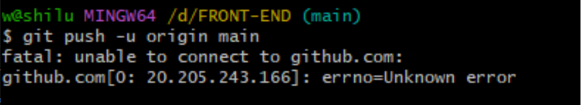
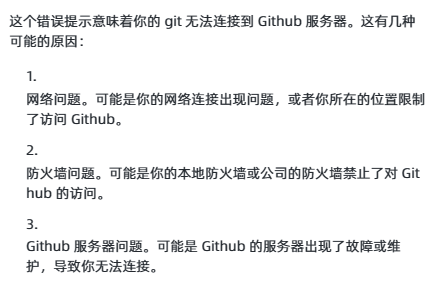

# GIT 上传文件出错

## 正常步骤 通过 git 上传文件

1. 首先进入你的 main 文件夹下，右键打开“Git Bash Here” ，弹出命令窗口 ，输入如下语句进行上传
2. git init ：在此文件夹生成一个.git 隐藏文件；
3. git add . : 将文件添加到缓存区( 注意这个"."，是有空格的，"."代表这个 test 这个文件夹下的目录全部都提交，也可以通过 git add 文件名 提交指定的文件)；
4. git status：查看现在的状态，也可以不看，随你啦，可以看到 picture 文件夹里面的内容都提交上去了；
5. git commit -m "这里是注释"：提交添加到缓存区的文件
6. git remote add origin https://xxx@xxx/test.git ： 添加新的 git 方式的 origin, github 上创建好的仓库和本地仓库进行关联
7. git push origin main : 把本地库的所有内容推送到远程仓库（github）上

## 出错在第 7 步

### 问题描述：本地库推送到 github 时，报错信息如下：

### 网上的解决方案

1. 
2. 第二种说法是需要用 https 才能读到数据，解决方法：输入命令
   git config --global url."https://github.com".insteadOf git://github.com
   如果再次 git clone 出现报错：
   fatal: unable to access ‘https://github.com/robbyrussell/oh-my-zsh.git/’: LibreSSL SSL_connect: SSL_ERROR_SYSCALL in connection to github.com:443
   输入命令：
   git config --global --unset http.proxy
   git config --global --unset https.proxy
   尝试过没有用
3. Git 是要专门设置代理才能正常用的，否则即使开了 clash，git 用的也是境内网。代理设置方式如下：
   git config --global http.proxy http://127.0.0.1:7890
   git config --global https.proxy http://127.0.0.1:7890
   因为是 global，所以在本地主机的所有 workspace 都会生效。另外，这个命令是永久性的，不会随着开关机消失，如果想要解除代理，用这个：
   git config --global --unset http.proxy
   git config --global --unset https.proxy
   除了上述永久设置代理的方法，我更建议临时设置，操作如下：
   export https_proxy=http://127.0.0.1:7890
   最终解决了！！！

# vscode 里使用插件错误

### 问题描述：在提交到 github 的时候也有报错，

    There was a problem with the editor '"d:\Users\w\AppData\Local\Programs\Microsoft VS Code\resources\app\extensions\git\dist\git-editor.sh"'.
    Please supply the message using either -m or -F option.
    然后就开始各种找bug

### 解决方案

1. 在 settings 里面加入了 git 的本地地址
2. 把 github 的内容先克隆到本地，用 vscode 打开就好了
