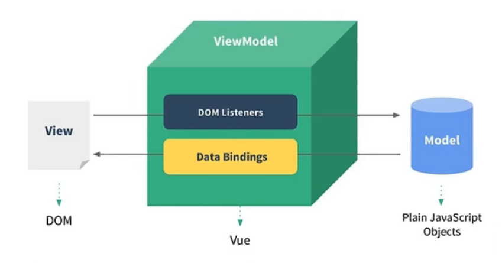
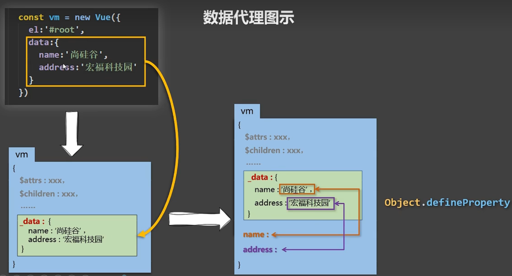

# Vue 核心

## 一、初识 Vue

1. 想让 Vue 工作，就必须创建一个 Vue 实例，且要传入一个配置对象
2. root 里的容器里的代码依然符合 html 规范，只不过混入了一些特殊的 Vue 语法
3. root 容器里面的代码被称为【Vue 模板】
4. Vue 实例和容器是一一对应的
5. 真实开发中只有一个 Vue 实例，并且会配合着组件一起使用
6. {{xxx}}中的 xxx 要写 js 表达式，且 xxx 可以自动读取到 data 中的所有属性；
7. 一旦 data 中的数据发生变化，那么页面中用到该数据的地方也会自动更新
8. 注意区分 js 表达式和 js 代码（代码）：
   - 表达式  
     (1). a  
     (2). a+b  
     (3). demo(1) 函数调用表达式  
     (4). x===y?'a':'b' 三元表达式
   - js 代码（语句）  
     (1). if(){}  
     (2). for(){}

## 二、模板语法

- Vue 模板语法有 2 大类：

1. 插值语法：  
   功能：用于解析标签体内容  
   写法：{{xxx}},xxx 要写 js 表达式，且 xxx 可以自动读取到 data 中的所有属性；
2. 指令语法  
   功能：用于解析标签（包括：标签属性，标签体内容，绑定事件）  
   举例：v-bind:href="xxx"或简写为:href:"xxx",xxx 同样要写 js 表达式，且 xxx 可以自动读取到 data 中的所有属性；

- 备注：  
   Vue 中有很多的指令。且形式都是：v-???，此处 v-bind 为举例

## 三、数据绑定

- Vue 中有 2 种数据绑定的方式：

1. 单向绑定(v-bind):数据只能从 data 流向页面。
2. 双向绑定(v-mode1):数据不仅能从 data 流向页面，还可以从页面流向 data。

- 备注：

1. 双向绑定一般都应用在表单类元素上（如：input、select 等）
2. v-model:value 可以简写为 v-model,因为 v-model 默认收集的就是 value 值。

## 四、el 与 data 的两种写法

- data 与 el 的 2 种写法

1. e1 有 2 种写法  
   (1) new Vue 时候配置 el 属性。  
   (2) 先创建 Vue 实例，随后再通过 vm.$mount('#root')指定 el 的值。
2. data 有 2 种写法  
   (1) 对象式  
   (2) 函数式

- 如何选择：目前哪种写法都可以，以后学习到组件时，data 必须使用函数式，否则会报错。

3.  一个重要的原则：  
    由 Vue 管理的函数，一定不要写箭头函数，一旦写了箭头函数，this 就不再是 Vue 实例了。

## 五、MVVM 模型

1. M:模型(Model):对应 data 中的数据
2. V:视图(View):模板
3. VM:视图模型(ViewModel):ue 实例对象 e

   

- 观察发现：

1. data 中所有的属性，最后都出现在了 vm 身上。
2. vm 身上所有的属性及 Vue 原型上所有属性，在 Vue 模板中都可以直接使用。

## 六、数据代理

### 1. Object.defineproperty 方法

1. writable:true 控制属性是否可以被修改，控制台也看的当为 TRUE 的时候属性值可以被修改
2. configurable:true 控制属性是否可以被删除
3. enumerable:true 控制属性是否可以枚举，true 的话简单的说就是可以遍历获取该值
4. 注意：当使用了 getter 或 setter 方法，不允许使用 writable 和 value 这两个属性(如果使用，会直接报错滴)

5. get 是获取值的时候的方法，类型为 function ，获取值的时候会被调用，不设置时为 undefined；  
   当有人读取 person 的 age 属性时，get 函数(getter)就会被调用，且返回值就是 age 的值

6. set 是设置值的时候的方法，类型为 function ，设置值的时候会被调用，undefined；  
   当有人修改 person 的 age 属性时，set 函数(setter)就会被调用，且会收到修改的具体值

7. get 或 set 不是必须成对出现，任写其一就可以
   get：当有人读取 person 的 age 属性时，get 函数(getter)就会被调用，且返回值就是 age 的值

### 2. Vue 中的数据代理

数据代理：通过一个对象代理对另一个对象中属性的操作（读/写）

1. Vue 中的数据代理：
   通过 vm 对象来代理 data 对象中属性的操作（读/写）
2. Vue 中数据代理的好处：
   更加方便的操作 data 中的数据
3. 基本原理：
   通过 Object,defineProperty()把 data 对象中所有属性添加到 vm 上。  
    为每一个添加到 vm 上的属性，都指定一个 getter/setter。  
    在 getter,/setter 内部去操作（读/写）data 中对应的属性。
   

## 七、事件处理

### 1. 事件的基本使用：

1. 使用 v-on:xxx 或@xxx 绑定事件，其中 xxx 是事件名：
2. 事件的回调需要配置在 nethods,对象中，最终会在 vm 上：
3. methods 中配置的函数，不要用箭头函数！否则 this 就不是 vm 了：
4. methods 中配置的函数，都是被 Vue 所管理的函数，this 的指向是 vm 或组件实例对象：
5. @click-="demo”和@click="demo($event)"效果一致，但后者可以传参。

### 2. 事件修饰符

1. prevent:阻止默认事件（常用）；
2. stop:阻止事件冒泡（常用）；
3. once:事件只触发一次（常用）；
4. capture:使用事件的捕获模式；
5. self:只有 event.target 是当前操作的元素是才触发事件；
6. passive:事件的默认行为立即执行，无需等待事件回调执行完毕。

### 3. 键盘事件

1. Vue 中常用的按键别名：  
   回车=>enter  
   删除=>delete (捕获“删除”和“退格”键)  
   退出=>esc  
   空格=>space  
   换行=>tab (特殊，必须和 keydown 一起使用)  
   上=>up  
   下=>down  
   左=>1eft  
   右=>right
2. Vue 未提供别名的按键，可以使用按键原始的 key 值去绑定，但注意要转为 kebab-case(短横线命名)
3. 系统修饰键（用法特殊）：ctrl、alt、shift、meta  
   (1) 配合 kyup 使用：按下修饰键的同时，再按下其他健，随后释放其他键，事件才被触发。  
   (2) 配合 keydown 使用：正常触发事件。
4. 也可以使用 keyCode 去指定具体的按键（不推荐）
5. Vue.config.keyCodes.自定义键名=键码，可以去定制按键别名

## 八、计算属性

- 计算属性：

1. 定义：要用的属性不存在，要通过已有属性计算得来。
2. 原理：底层借助了 Objcet.defineproperty 方法提供的 getter 和 setter。
3. get 函数什么时候执行？  
   (1)初次读取时会执行一次。  
   (2)当依赖的数据发生改变时会被再次调用。
4. 优势：与 methods 实现相比，内部有缓存机制（复用），效率更高，调试方便。
5. 备注:计算属性最终会出现在 Vm 上，直接读取使用即可。如果算属性要被多改，那必须写 set 函数去啊应修改，且 set 中要引起计算时依懒的数据发生。

- 计算属性的简写:只考虑读取不考虑修改的时候用简写，因为不用 set

```JS
fullName: {
   get() {
         console.log('get');
         return this.firstName + '-' + this.lastName
                },
   set() {
         console.log('set', value);
         const arr = value.split('-')
         this.firstName = arr[0]
         this.lastName = arr[1]
                }
            }
```

简写为：

```JS
fullName(){
   console.log('get');
   return this.firstName + '-' + this.lastName
         },
```

- 其他知识点： slice() 方法

1. slice(start, end) 方法可提取字符串的某个部分，并以新的字符串返回被提取的部分。
2. 使用 start（包含） 和 end（不包含） 参数来指定字符串提取的部分。
3. start 参数字符串中第一个字符位置为 0, 第二个字符位置为 1, 以此类推，如果是负数表示从尾部截取多少个字符串，slice(-2) 表示提取原数组中的倒数第二个元素到最后一个元素（包含最后一个元素）。
4. end 参数如果为负数，-1 指字符串的最后一个字符的位置，-2 指倒数第二个字符，以此类推。

```JS
var str="Hello world!";
var n=str.slice(3，8);
//lo wo
```

- 其他知识点： split() 方法

1. split() 方法用于把一个字符串分割成字符串数组。
2. 提示： 如果把空字符串 ("") 用作 separator，那么 stringObject 中的每个字符之间都会被分割。
3. 注意： split() 方法不改变原始字符串。

```JS
var str="How are you doing today?";
var n=str.split("o");
//结果是：H,w are y,u d,ing t,day?
```

## 九、监视属性

- 监视属性 watch:

1. 被监视的属性变化时，回调函数自动调用，进行相关操作
2. 监视的属性必须存在，才能进行监视！！
3. 监视的两种写法：  
   (1) new Vue 时传入 watch 配置
   ```JS
   watch: {
            isHot: {
                immediate: true,
                deep:true //深度监视
                handler(newValue, oldValue) {
                }
            }
        }
   ```
   (2) 通过 vm.$watch 监视
   ```JS
       vm.$watch('isHot', {
        immediate: true,
        deep:true //深度监视
        handler(newValue, oldValue) {
        }
    })
   ```

- 深度监视：  
  (1) Vue 中的 watch 默认不监测对象内部值的改变（一层）。  
  (2).配置 deep:true 可以监测对象内部值改变（多层）。  
  备注：  
  (1)Vue 自身可以监测对象内部值的改变，但 Vue 提供的 watch 默认不可以！  
  (2)使用 watch 时根据数据的具体结构，决定是否采用深度监视。

- 监视属性的简写:不需要 immediate 和 deep 的时候,不能写箭头函数

  ```JS
  isHot: {
        handler(newValue, oldValue) {
        }
           }

  vm.$watch('isHot', function(newValue, oldValue){
       })
  ```

- 其他知识点

1. computed 和 watch 之间的区别：  
   (1)computed 能完成的功能，watch 都可以完成。  
   (2)watch 能完成的功能，computed 不一定能完成，例如：watch 可以进行异步操作。

2. 两个重要的小原则：  
   (1) 所被 Vue 管理的函数，最好写成普通函数，这样 this 的指向才是 vm 或组件实例对象。  
   (2)所有不被 Vue 所管理的函数（定时器的回调函数、ajax 的回调函数等），最好写成箭头函数，这样 this 的指向才是 vm 或组件实例对象

## 十、绑定样式

1. c1ass 样式  
   写法：class:="xXx”XXx 可以是字符串、对象、数组。  
   字符串写法适用于: 类名不确定，要动态获取。  
   对象写法适用于： 要绑定多个样式，个数不确定，名字也不确定。  
   数组写法适用于： 要绑定多个样式，个数确定，名字也确定，但不确定用不用
2. style 样式
   :style:="{fontsize:Xxx}"其中 Xxx 是动态值。
   :style="[a,b]"其中 a、b 是样式对象。

## 十一、条件渲染

### v-if 写法：

(1).v-if="表达式”  
(2).v-else-if="表达式"  
(3).V-e1se="表达式  
 适用于：切换频率较低的场景。  
 特点：不展示的 DOM 元素直接被移除。  
 注意：v-if 可以和：v-else-if、v-else 一起使用，但要求结构不能被“打断”。

### v-show

写法：v-show="表达式”  
 适用于：切换频率较高的场景。  
 特点：不展示的 D0M 元素未被移除，仅仅是使用样式隐藏掉

- 备注：使用 V-if 的时，元素可能无法获取到， 而使用 V-show 一定可以获取到。

## 十二、列表渲染

### v-for 指令

1. 用于展示列表数据
2. 语法：v-for="(item,index)in xxx":key="yyy"
3. 可遍历：数组、对象、字符串（用的很少）、指定次数（用的很少）

### 面试题：react、vue 中的 key 有什么作用？(key 的内部原理)

1. 虚拟 DoM 中 key 的作用：  
   key 是虚拟 DoM 对象的标识，当状态中的数据发生变化时，Vue 会根据【新数据】生成【新的虚拟 DoM】,
   随后 Vue 进行【新虚拟 DoM】与【旧虚拟 DoM】的差异比较，比较规则如下。
2. 对比规则：  
   (1).旧虚拟 DoM 中找到了与新虚拟 DoM 相同的 key:
   @.若虚拟 DOM 中内容没变，直接使用之前的真实 DOM!  
   ②.若虚拟 D0M 中内容变了，则生成新的真实 D0M,随后替换掉页面中之前的真实 D0M。  
   (2).旧虚拟 DoM 中未找到与新虚拟 DoM 相同的 key 创建新的真实 DOM,随后渲染到到页面。
3. 用 index 作为 key 可能会引发的问题：  
   1.若对数据进行：逆序添加、逆序删除等破坏顺序操作：会产生没有必要的真实 D0M 更新==>界面效果没问题，但效率低。  
   2.如果结构中还包含输入类的 D0M: 会产生错误 D0M 更新 ==> 界面有问题。
4. 开发中如何选择 key?  
   1.最好使用每条数据的唯一标识作为 key,比如 id、手机号、身份证号、学号等唯一值。  
    2.如果不存在对数据的逆序添加、逆序刚除等破坏顺序操作，仅用于渲染列表用于展示，使用 index 作为 key 是没有问题的

### indexOf

### region
