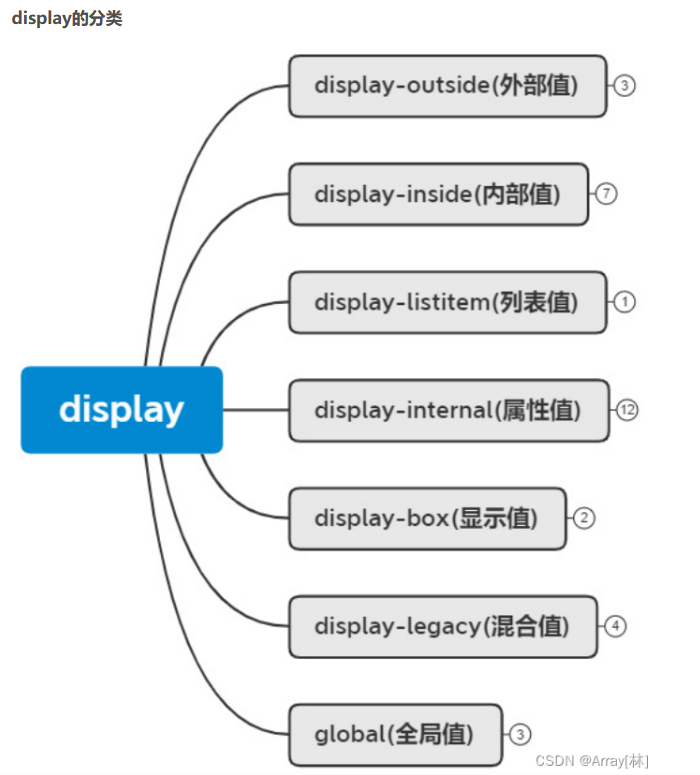

# CSS 样式笔记

## display

在 CSS 中 display 属性表示"显示框类型"，即不同的盒模型。简单来说，可以把块级盒子转成内联盒子，也可以把内联盒子转换为块级盒子。

### display: inline-block：行内块

当你将一个元素的 display 属性设置为 inline-block 时，它将以内联块级元素的方式显示。这意味着元素会在一行上显示，并且可以设置宽度、高度、内外边距等属性，同时仍保留内联元素的特性，可以与其他元素在同一行内显示。

- 常用于以下场景：

  1. 创建水平排列的元素：通过将多个元素的显示方式设置为 inline-block，可以在一行内创建水平排列的元素，类似于菜单、按钮组等。

  2. 设置宽度和高度：与普通的内联元素相比，inline-block 元素可以设置宽度、高度以及内外边距等属性，使其具备块级元素的特性。

  3. 保留行内元素的特性：与块级元素相比，inline-block 元素可以在一行内显示，并且可以与其他元素共享一行，适用于需要结合文本或其他内联元素进行布局的情况。

- 需要注意的是，inline-block 元素之间会存在默认的空白间距，可以通过设置父元素的 font-size: 0; 或者在 HTML 代码中删除元素之间的空白字符来解决这个问题。

- 总结起来，display: inline-block; 是一种常用的 CSS 属性，用于将元素以内联块级元素的方式显示，使其具备块级元素的特性，并在一行内与其他元素共享空间。

## vertical-align

用于设置一个元素的垂直对齐方式，但是它只针对于行内元素或者行内块元素有效

## cursor:pointer

1. cursor : 网页浏览时用户鼠标指针的样式或图形形状。
2. 属性值：  
   default：默认光标（通常是一个箭头）  
   auto：默认，浏览器设置的光标  
   crosshair：光标为十字线  
   pointer：光标为一只手  
   move：光标为某对象可移动  
   text：光标指示文本  
   wait：光标指示程序正在忙（通常是一只表或者一个沙漏）
